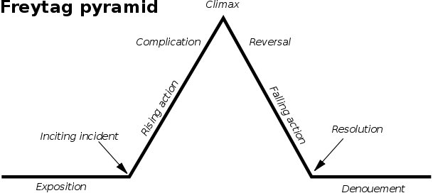
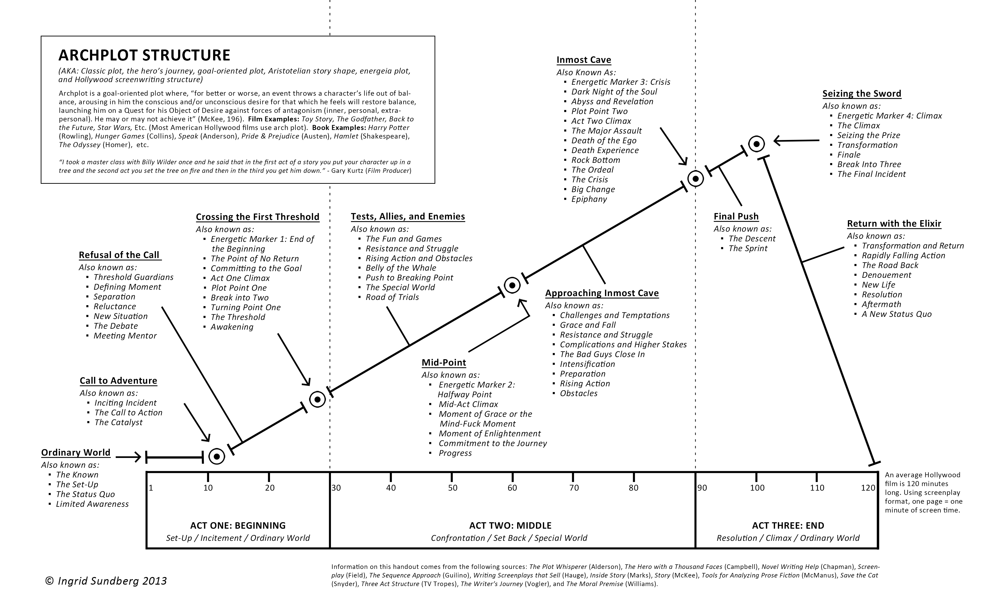

# 

## Outline

* Screenplay naratology
* Story workbench
* Scheherazade

## Screenplay naratology

* Syd Field: Screenplay
* Robert McKee: Story
* Kristin Thompson: Storytelling in the New Hollywood: Understanding classical Narrative Technique
* Blake Snyder: Save the cat

### Blake Snyder beat sheet

1. **Opening image**
1. Theme stated
1. Set-up
1. Catalyst
1. Debate
1. **Break into two**
1. B story
1. Fun and Games
1.  Midpoint
1. Bad guys close in
1. All is lost
1. Dark knight of the soul
1. **Break into three**
1. Finale
1. Final image

### Analogies

* Freytag's triangle

* The hero's journey

* Archplot structure - Ingrid Sundberg

### Paperman

* Director: John Kahrs
* Writers: Clio Chiang (story), Kendelle Hoyer
* Genre: OUT OF THE BOTTLE meets BUDDY LOVE when boy meets girl, boy loses girl, etc.

### Blake Snydr patterns and genres

1. Monster in the house
1. Golden fleece
1. Out of the bottle
1. Dude with a problem
1. Rites of passage
1. Buddy love
1. Whydunnit
1. Fool triumphant
1. Institutionalized
1. Superhero

#### Monster in the house stories

1. A monster
1. A house
1. A sin

Examples:

* Alien
* Fatal Attraction
* Scream

#### Golden fleence stories

1. A road
1. A team
1. A prize

Examples:

* Wizard of Oz
* Saving private Ryan
* Ocean's Eleven

#### Out of the bottle stories

1. A wish
1. A spell
1. A lesson

Example:

* Freaky Friday
* What women want
* Eternal sunshine of the spotless mind

#### Dude with a problem

1. An innocent hero
1. A sudden event
1.A life or death battle

Examples:

* Three days of the condor
* Deep impact
* Open water

#### Rites of passage

1. A life problem
1. A wrong way
1. An acceptance of a hard truth

Examples:

* Ten
* Kramer vs. Kramer
* Napoleon dynamite

#### Buddy Love

1. An incomplete hero
1. A counterpart
1. A complication

Examples:

* Letal weapon
* When Harry met Sally
* Titanic

#### Whydunnit

1. A detective 
1. A secret
1. A dark turn

Examples:

* All the president's men
* Blade Runner
* Fargo

#### Fool triumphant

1. A fool
1. An establishment
1. A transmutation

Examples:

* Being there
* Legally blonde
* Forrest gump

#### Institutionalized stories

1. A group
1. A choice
1. A sacrifice

Examples:

* Mash
* Do the right thing
* Crash

#### Superhero

1. A special power
1. An opponent
1. A curse

Examples:

* The Lion King
* The Matrix
* Gladiator

## Story annotations

* NarrativeML - Inderjit Mani (Computational Modeling of Narrative)
* Story Workbench annotation toolkit - Mark Finlayson (Learning Narrative Structure from Annotated Folktales)
* Scheherazade annotation toolkit - David Elson (Modeling Narrative Discourse-

### Propp Roles

1. Hero [C=counteraction, Î=departure, E=hero's reaction, W=wedding]
1. Villain [A=villany, H=struggle, Pr=pursuit]
1. Donor [D=offer, F=magical agent]
1. Helper [G=guidance, K=resolution, Rs=rescue, N=solution, T=transfiguration]
1. Princess [M=difficult task, J=branding, Ex=exposure, Q=recognition, U=punishment, W=wedding]
1. Dispatcher [B=meditation]
1. False Hero [C=counteraction, Î=departure, E=hero's reaction, L=unfounded claim]

#### Propp Moves

* Preparation: beta-gamma-delta-epsilon-zeta-theta
* Complication: A(a)BC 
* Transference: ÎDEFG
* Conflict: HIJK
* Return: |PrRsoLMN
* REcognition: QExTUW

There is an Initial Situation [alpha] that is not counted as a function; 
it enumerates the family members or introduces the hero by name or status. 
The lower case 'a' in the Compliction group denotes a "Lack", which is an alternative form of Villainy [A]
wherein a family member either lacks something or desires something important. 
The movement of the tale depends on the presence and type(s) of [A] or [a] function, 
but this pair is exclusive; a single narrative axis cannot have both an [A] and [a]. 
It is possible to have both an [A] and [a] if a tale has multiple moves. A move 
is created by a new Villainy (or Lack). 
These may be woven into the primary narrative axis either consecutively or concurrently. 

#### Morphological analysis of the Harry Potter Books and Series

The Preparation group is the backstory developed and revealed in Prisoner of Azkaban, Half-Blood Prince and Deathly Hallows. The Meditation [B],
the misfortune made known to Harry, is gradually unfolded in the first six books of the series, and Dumbledore
gradually dispatches Harry to defeat Voldemort. The Counteraction occurs ...

### Scheherazade

* Scheherazade is a symbolic annotation/encoding tool for stories.
* Created by David Elson during his PhD thesis in 2012. 
* Stories are represented with Story Intention Graphs.
* Download [http://www.cs.columbia.edu/~delson/software.shtml](http://www.cs.columbia.edu/~delson/software.shtml)

### The Wily Lion

A Lion watched a fat Bull feeding in a meadow, and his mouth watered when he thought of the royal feast he would make, but he did not dare to attack him, for he was afraid of his sharp horns. Hunger, however, presently compelled him to do something: and as the use of force did not promise success, he determined to resort to artifice. Going up to the Bull in friendly fashion, he said to him, "I cannot help saying how much I admire your magnificent figure. What a fine head! What powerful shoulders and thighs! But, my dear friend, what in the world makes you wear those ugly horns? You must find them as awkward as they are unsightly. Believe me, you would do much better without them." The Bull was foolish enough to be persuaded by this flattery to have his horns cut off; and, having now lost his only means of defence, fell an easy prey to the Lion.

#### Timeline

| Node | Example|
|-----|-------|
| TE1 | A Lion watched a fat Bull feeding in a meadow|
| TE2 | Going up to the Bull in a friendly fashion|
| TE3 | The Bull fell an easy prey to the Lion|
| P1 | `watch(lion, feed(bull, meadow))`|
| P2 | `approach(lion, bull)`|
| P3 | `friendly()`|
| P4 | `identity(bull, prey(lion))`|

